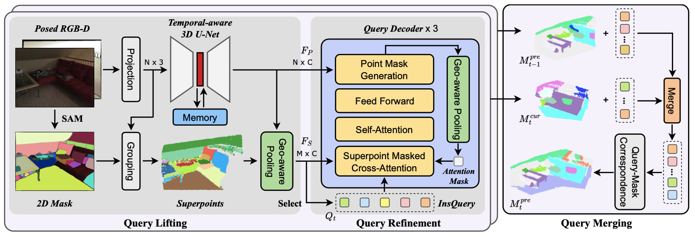

# EmbodiedSAM: Online Segment Any 3D Thing in Real Time
### [Paper](https://arxiv.org/abs/2408.11811) | [Project Page](https://xuxw98.github.io/ESAM/) | [Video](https://cloud.tsinghua.edu.cn/f/f75279f89bf64720b8ec/?dl=1)

> EmbodiedSAM: Online Segment Any 3D Thing in Real Time  
> [Xiuwei Xu](https://xuxw98.github.io/), Huangxing Chen, [Linqing Zhao](https://scholar.google.com/citations?user=ypxt5UEAAAAJ&hl=zh-CN&oi=ao), [Ziwei Wang](https://ziweiwangthu.github.io/), [Jie Zhou](https://scholar.google.com/citations?user=6a79aPwAAAAJ&hl=en&authuser=1), [Jiwen Lu](http://ivg.au.tsinghua.edu.cn/Jiwen_Lu/)


In this work, we presented ESAM, an efficient framework that leverages vision foundation models for <b>online</b>, <b>real-time</b>, <b>fine-grained</b>, <b>generalized</b> and <b>open-vocabulary</b> 3D instance segmentation. 


## News
- [2025/2/11]: EmbodiedSAM is selected as an oral paper in ICLR 2025!
- [2025/1/23]: EmbodiedSAM is accepted to ICLR 2025 with a top 2% rating!
- [2024/10/01]: Demo code available at [here](https://github.com/xuxw98/ESAM/blob/main/docs/demo.md).
- [2024/8/27]: Fix some bugs.
- [2024/8/22]: Code and demo released.


## Demo
### Bedroom:


### Office:


Demos are a little bit large; please wait a moment to load them. Welcome to the home page for more complete demos and detailed introductions.


## Method 

Method Pipeline:


## Getting Started
For environment setup and dataset preparation, please follow:
* [Installation](./docs/installation.md)
* [Dataset Preparation](./docs/dataset_preparation.md)

For training and evaluation, please follow:
* [Train and Evaluation](./docs/run.md)
  
For visualization demo, please follow:
* [Visualization Demo](./docs/demo.md)


## Main Results
We provide the checkpoints for quick reproduction of the results reported in the paper.

**Class-agnostic 3D instance segmentation results on ScanNet200 dataset:**

|  Method  |   Type  |     VFM     |  AP  | AP@50 | AP@25 | Speed(ms) | Downloads |
|:--------:|:-------:|:-----------:|:----:|:-----:|:-----:|:---------:|:---------:|
| [SAMPro3D](https://github.com/GAP-LAB-CUHK-SZ/SAMPro3D) | Offline |     [SAM](https://github.com/facebookresearch/segment-anything)     | 18.0 |  32.8 |  56.1 |     --    |     --    |
|   [SAI3D](https://github.com/yd-yin/SAI3D)  | Offline | [SemanticSAM](https://github.com/UX-Decoder/Semantic-SAM) | 30.8 |  50.5 |  70.6 |     --    |     --    |
|   [SAM3D](https://github.com/Pointcept/SegmentAnything3D)  |  Online |     SAM     | 20.6 |  35.7 |  55.5 | 1369+1518 |     --    |
|   ESAM   |  Online |     SAM     | 42.2 |  63.7 |  79.6 |  1369+**80**  |   [model](https://cloud.tsinghua.edu.cn/f/426d6eb693ff4b1fa04b/?dl=1)   |
|  ESAM-E  |  Online |   [FastSAM](https://github.com/CASIA-IVA-Lab/FastSAM)   | **43.4** |  **65.4** |  **80.9** |   **20**+**80**   |   [model](https://cloud.tsinghua.edu.cn/f/7578d7e3d6764f6a93ee/?dl=1)   |

**Dataset transfer results from ScanNet200 to SceneNN and 3RScan:**
<table class="tg"><thead>
  <tr>
    <th class="tg-b2st" rowspan="2">Method</th>
    <th class="tg-b2st" rowspan="2">Type </th>
    <th class="tg-b2st" colspan="3">ScanNet200--&gt;SceneNN</th>
    <th class="tg-b2st" colspan="3">ScanNet200--&gt;3RScan</th>
  </tr>
  <tr>
    <th class="tg-wa1i">AP</th>
    <th class="tg-wa1i">AP@50</th>
    <th class="tg-wa1i">AP@25</th>
    <th class="tg-wa1i">AP</th>
    <th class="tg-wa1i">AP@50</th>
    <th class="tg-wa1i">AP@25</th>
  </tr></thead>
<tbody>
  <tr>
    <td class="tg-nrix">SAMPro3D</td>
    <td class="tg-nrix">Offline</td>
    <td class="tg-nrix">12.6</td>
    <td class="tg-nrix">25.8</td>
    <td class="tg-nrix">53.2</td>
    <td class="tg-nrix">3.9</td>
    <td class="tg-nrix">8.0</td>
    <td class="tg-nrix">21.0</td>
  </tr>
  <tr>
    <td class="tg-nrix">SAI3D</td>
    <td class="tg-nrix">Offline</td>
    <td class="tg-nrix">18.6</td>
    <td class="tg-nrix">34.7</td>
    <td class="tg-nrix">65.7</td>
    <td class="tg-nrix">5.4</td>
    <td class="tg-nrix">11.8</td>
    <td class="tg-nrix">27.4</td>
  </tr>
  <tr>
    <td class="tg-nrix">SAM3D</td>
    <td class="tg-nrix">Online</td>
    <td class="tg-nrix">15.1</td>
    <td class="tg-nrix">30.0</td>
    <td class="tg-nrix">51.8</td>
    <td class="tg-nrix">6.2</td>
    <td class="tg-nrix">13.0</td>
    <td class="tg-nrix">33.9</td>
  </tr>
  <tr>
    <td class="tg-nrix">ESAM</td>
    <td class="tg-nrix">Online</td>
    <td class="tg-nrix"><b>28.8</b></td>
    <td class="tg-nrix"><b>52.2</b></td>
    <td class="tg-nrix">69.3</td>
    <td class="tg-nrix"><b>14.1</b></td>
    <td class="tg-nrix"><b>31.2</b></td>
    <td class="tg-nrix"><b>59.6</b></td>
  </tr>
  <tr>
    <td class="tg-nrix">ESAM-E</td>
    <td class="tg-nrix">Online</td>
    <td class="tg-nrix">28.6</td>
    <td class="tg-nrix">50.4</td>
    <td class="tg-nrix"><b>71.0</b></td>
    <td class="tg-nrix">13.9</td>
    <td class="tg-nrix">29.4</td>
    <td class="tg-nrix">58.8</td>
  </tr>
</tbody></table>

**3D instance segmentation results on ScanNet dataset:**
<table class="tg"><thead>
  <tr>
    <th class="tg-gabo" rowspan="2">Method</th>
    <th class="tg-gabo" rowspan="2">Type</th>
    <th class="tg-gabo" colspan="3">ScanNet</th>
    <th class="tg-gabo" colspan="3">SceneNN</th>
    <th class="tg-gabo" rowspan="2">FPS</th>
    <th class="tg-gabo" rowspan="2">Download</th>
  </tr>
  <tr>
    <th class="tg-uzvj">AP</th>
    <th class="tg-uzvj">AP@50</th>
    <th class="tg-uzvj">AP@25</th>
    <th class="tg-uzvj">AP</th>
    <th class="tg-uzvj">AP@50</th>
    <th class="tg-uzvj">AP@25</th>
  </tr></thead>
<tbody>
  <tr>
    <td class="tg-9wq8"><a href=https://github.com/SamsungLabs/td3d>TD3D</a></td>
    <td class="tg-9wq8">offline</td>
    <td class="tg-9wq8">46.2</td>
    <td class="tg-9wq8">71.1</td>
    <td class="tg-9wq8">81.3</td>
    <td class="tg-9wq8">--</td>
    <td class="tg-9wq8">--</td>
    <td class="tg-9wq8">--</td>
    <td class="tg-9wq8">--</td>
    <td class="tg-9wq8">--</td>
  </tr>
  <tr>
    <td class="tg-9wq8"><a href=https://github.com/oneformer3d/oneformer3d>Oneformer3D</a></td>
    <td class="tg-9wq8">offline</td>
    <td class="tg-9wq8">59.3</td>
    <td class="tg-9wq8">78.8</td>
    <td class="tg-9wq8">86.7</td>
    <td class="tg-9wq8">--</td>
    <td class="tg-9wq8">--</td>
    <td class="tg-9wq8">--</td>
    <td class="tg-9wq8">--</td>
    <td class="tg-9wq8">--</td>
  </tr>
  <tr>
    <td class="tg-9wq8"><a href=https://github.com/THU-luvision/INS-Conv>INS-Conv</a></td>
    <td class="tg-9wq8">online</td>
    <td class="tg-9wq8">--</td>
    <td class="tg-9wq8">57.4</td>
    <td class="tg-9wq8">--</td>
    <td class="tg-9wq8">--</td>
    <td class="tg-9wq8">--</td>
    <td class="tg-9wq8">--</td>
    <td class="tg-9wq8">--</td>
    <td class="tg-9wq8">--</td>
  </tr>
  <tr>
    <td class="tg-9wq8"><a href=https://github.com/xuxw98/Online3D>TD3D-MA</a></td>
    <td class="tg-9wq8">online</td>
    <td class="tg-9wq8">39.0</td>
    <td class="tg-9wq8">60.5</td>
    <td class="tg-9wq8">71.3</td>
    <td class="tg-9wq8">26.0</td>
    <td class="tg-9wq8">42.8</td>
    <td class="tg-9wq8">59.2</td>
    <td class="tg-9wq8">3.5</td>
    <td class="tg-9wq8">--</td>
  </tr>
  <tr>
    <td class="tg-9wq8">ESAM-E</td>
    <td class="tg-9wq8">online</td>
    <td class="tg-9wq8">41.6</td>
    <td class="tg-9wq8">60.1</td>
    <td class="tg-9wq8">75.6</td>
    <td class="tg-9wq8">27.5</td>
    <td class="tg-9wq8">48.7</td>
    <td class="tg-uzvj"><b>64.6</b></td>
    <td class="tg-uzvj"><b>10</b></td>
    <td class="tg-9wq8"><a href=https://cloud.tsinghua.edu.cn/f/1eeff1152a5f4d4989da/?dl=1>model</a></td>
  </tr>
  <tr>
    <td class="tg-nrix">ESAM-E+FF</td>
    <td class="tg-nrix">online</td>
    <td class="tg-wa1i"><b>42.6</b></td>
    <td class="tg-wa1i"><b>61.9</b></td>
    <td class="tg-wa1i"><b>77.1</b></td>
    <td class="tg-wa1i"><b>33.3</b></td>
    <td class="tg-wa1i"><b>53.6</b></td>
    <td class="tg-nrix">62.5</td>
    <td class="tg-nrix">9.8</td>
    <td class="tg-nrix"><a href=https://cloud.tsinghua.edu.cn/f/4c2dd1559e854f48be76/?dl=1>model</a></td>
  </tr>
</tbody></table>

**Open-Vocabulary 3D instance segmentation results on ScanNet200 dataset:**
| Method |  AP  | AP@50 | AP@25 |
|:------:|:----:|:-----:|:-----:|
|  SAI3D |  9.6 |  14.7 |  19.0 |
|  ESAM  | **13.7** |  **19.2** |  **23.9** |


## TODO List
- [x] Release code and checkpoints.
- [x] Release the demo code to directly run ESAM on streaming RGB-D video.

## Contributors
Both students below contributed equally and the order is determined by random draw.
- [Xiuwei Xu](https://xuxw98.github.io/)
- Huangxing Chen

Both advised by [Jiwen Lu](https://ivg.au.tsinghua.edu.cn/Jiwen_Lu/).

## Acknowledgement
We thank a lot for the flexible codebase of [Oneformer3D](https://github.com/oneformer3d/oneformer3d) and [Online3D](https://github.com/xuxw98/Online3D), as well as the valuable datasets provided by [ScanNet](https://github.com/ScanNet/ScanNet), [SceneNN](https://github.com/hkust-vgd/scenenn) and [3RScan](https://github.com/WaldJohannaU/3RScan).


## Citation
```
@article{xu2024esam, 
      title={EmbodiedSAM: Online Segment Any 3D Thing in Real Time}, 
      author={Xiuwei Xu and Huangxing Chen and Linqing Zhao and Ziwei Wang and Jie Zhou and Jiwen Lu},
      journal={arXiv preprint arXiv:2408.11811},
      year={2024}
}
```
